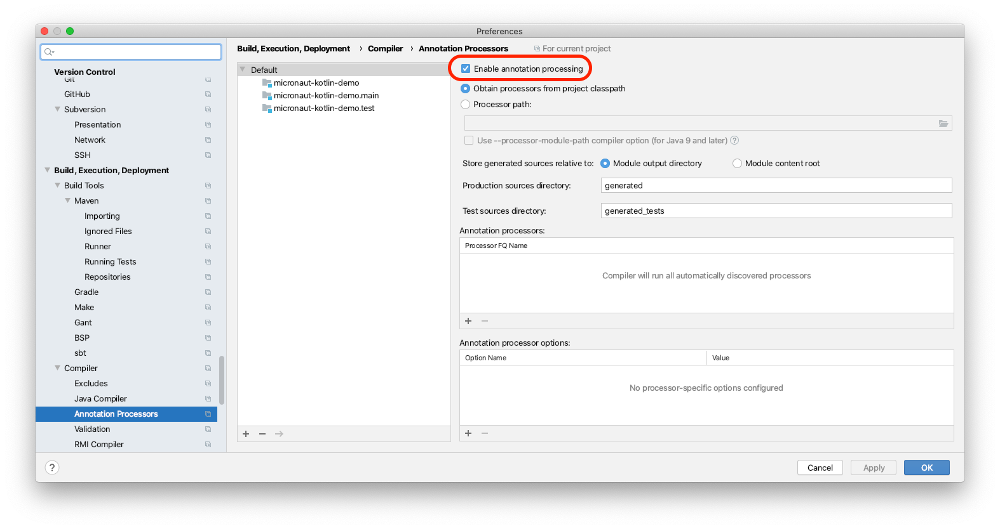
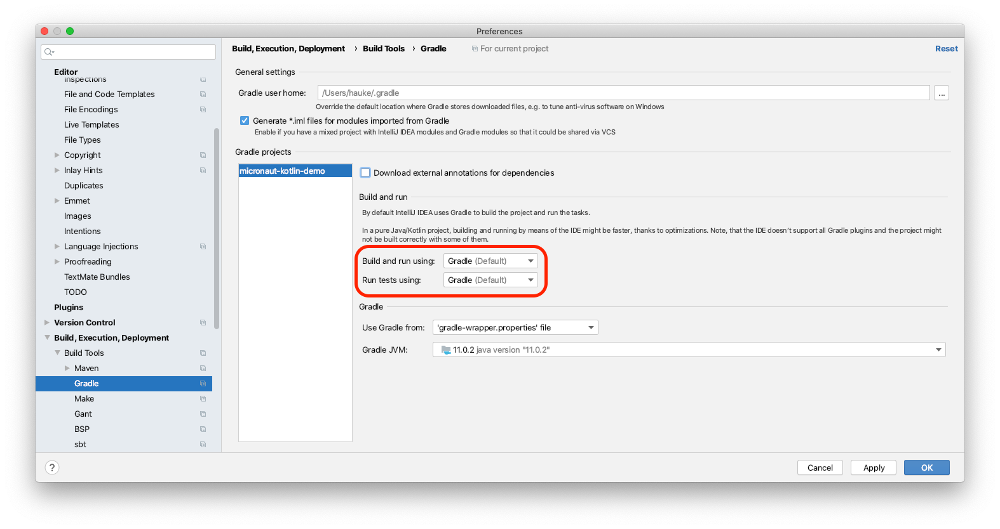

# micronaut-kotlin-demo

Micronaut Kotlin Microservice Tech Stack Demo

## What I did so far

### Initial setup

This creates a Micronaut project with Kotlin as language, and the *service* profile by
default:

`mn create-app --lang=kotlin de.shinythings.micronaut-kotlin-demo`

To enable automatic application restarting I added the following lines to the `application.yml`:

```yaml
micronaut:
  io:
    watch:
      paths: src/main
      restart: true

```

Then I added the following dependency in `build.gradle` to improve the file watch performance on
OS X:

```groovy
dependencies {
    developmentOnly "io.micronaut:micronaut-runtime-osx:1.3.3"
}
```

To use automatic application reloading I need to start the application in a shell via Gradle:

```shell script
./gradlew run --continuous
```

To make the application run from within IntelliJ IDEA I enabled annotation processing.



To make the test from from within IntelliJ IDEA I configured Gradle to be used to build the project
and run all tasks.



I created a first simple test to call the HTTP endpoint. I decided to go with
[the "boring" `AnnotationSpec`](https://github.com/kotest/kotest/blob/master/doc/styles.md#annotation-spec) from
[Kotest](https://github.com/kotest/kotest) since all the other fancy testing styles proved to become slow in IntelliJ
IDEA after they reach a certain size.
